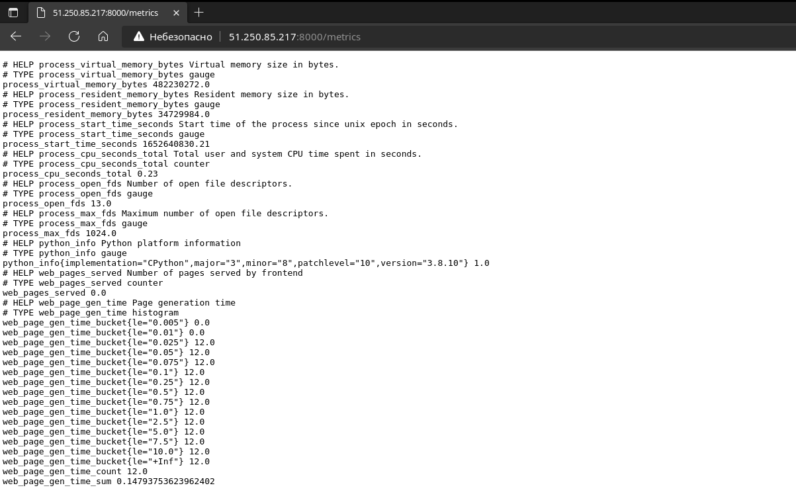
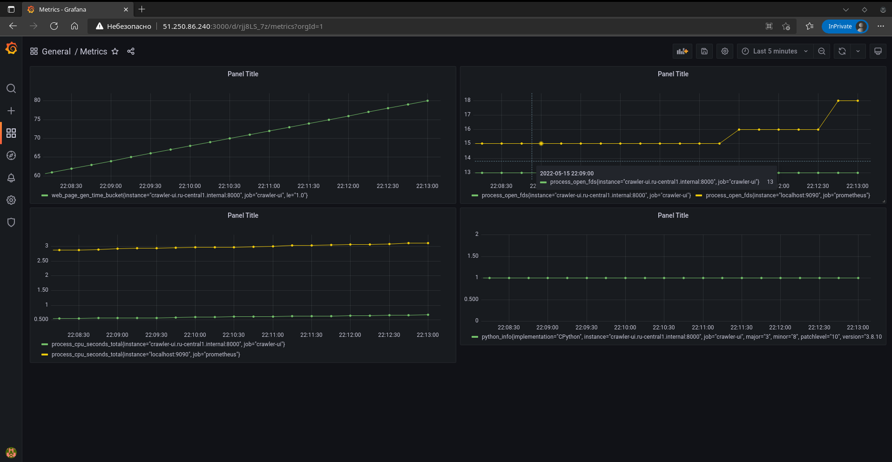
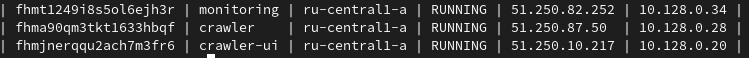
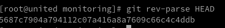
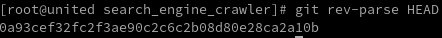
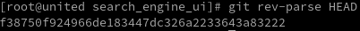
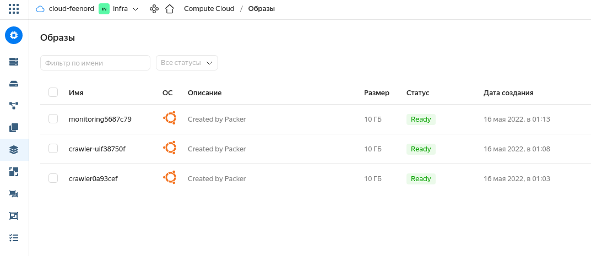

# coursework
## Создание процесса непрерывной поставки для приложения с применением Практик CI/CD.
# 1. Приложение "Search Engine Crawler".
# 2. Web - intarface "Search Engine UI".
# 3. Monitoring tool - "Prometheus + Grafana".
# 4. Список необходимого ПО для реализации проекта.
# 5. Запуск.
# 6. Версионирование.

## 1.1 - Описание -
Поисковый бот для сбора текстовой информации с веб-страниц и ссылок.
Бот помещает в очередь url переданный ему при запуске. 
Затем он начинает обрабатывать все url в очереди. 
Для каждого url бот загружает содержимое страницы, записывая в БД связи между сайтами, между сайтами и словами. 
Все найденые на странице url помещает обратно в очередь.

# 2.1 - Описание -
Веб-интерфейс поиска слов и фраз на проиндексированных ботом сайтах.
Веб-интерфейс минимален, предоставляет пользователю строку для запроса и результаты. 

Для проверки работы веб-интефейса надо зайти по адресу ***http://Crawler_UI_HOST_IP:8000/***, 
где ***Crawler_UI_HOST_IP*** - внешний адрес хоста на котором запущен веб-интерфейс.
# 3.1 - Описание - Prometheus собирает метрики по адресу http://monitoring_ip:8000/metrics

# 3.2 - Grafana - на основе метрик собранных Prometheus выводит информацию на Dashboard's
Посмотреть можно тут ***http://monitoring_ip:3000/d/rjj8LS_7z/metrics?orgId=1*** .
# Login = admin
# Password = 265525

# 4.1 Список ПО и версии
# 4.2 Для образа приложения "Search Engine Crawler" было использовано:
- Yandex Cloud CLI 0.89.0 linux/amd64
- pip 20.0.2 from /usr/lib/python3/dist-packages/pip (python 3.8)
- Ubuntu 
  - DISTRIB_ID=Ubuntu
  - DISTRIB_RELEASE=20.04
  - DISTRIB_CODENAME=focal
  - DISTRIB_DESCRIPTION="Ubuntu 20.04.4 LTS"
- RabbtMQ - 3.8.2
- MONGODB - 3.6.8
# 4.3 Для образа web intarface - "Search Engine UI" было использовано:
- Yandex Cloud CLI 0.89.0 linux/amd64
- pip 20.0.2 from /usr/lib/python3/dist-packages/pip (python 3.8)
- Ubuntu 
  - DISTRIB_ID=Ubuntu
  - DISTRIB_RELEASE=20.04
  - DISTRIB_CODENAME=focal
  - DISTRIB_DESCRIPTION="Ubuntu 20.04.4 LTS"
# 4.4 Для образа Мониторинга использовалось:
- Yandex Cloud CLI 0.89.0 linux/amd64
- Ubuntu 
  - DISTRIB_ID=Ubuntu
  - DISTRIB_RELEASE=20.04
  - DISTRIB_CODENAME=focal
  - DISTRIB_DESCRIPTION="Ubuntu 20.04.4 LTS"
- Grafana Version 8.5.2
- prometheus --version
  - prometheus, version 2.31.0
  - go version:       go1.17.2
  - platform:         linux/amd64
# 4.5 Для разворачивания Образов выше описанных приложений:
- Yandex Cloud CLI 0.89.0 linux/amd64
- Terraform v0.13.7
- Packer - v1.8.0
- git version 2.36.1
- go version go1.18 linux/amd64 (для локальной сборки провайдера yandex.cloud)
- для локальной настройки провайдера яндекс в терраформ использовался данный репозиторий https://github.com/yandex-cloud/terraform-provider-yandex/blob/master/README.md
# 5. How it's work? (Запуск)
## Для того что бы запустить данный проект необходимо:
1. Установить ПО перечисленное в пункте 4.5 Данного readme
2. выполнить команду ***git clone git@github.com:feenord/coursework.git*** 
3. После завершения процесса клонирования необходимо из корневого каталога "coursework" выполнить запуск скрипта start_deploy.sh
4. Скрипт запускается таким вот образом ***./start_deploy.sh***.
5. Дождаться выполнения скрипта - в конце скрипт выдаст вот такую информацию:

В данном скриншоте колонки делятся по такому принципу:
1. id-image; 2. name; 3 zone-id; 4. status - виртуальной машины; 5 внешний IP-HOST;
6. Подставив внешние IP-HOST в ссылки из пунктов: ***"2.1,3.1,3.2"*** . У Вас откроется необходимые Веб Интрефейсы описанные на скриншотах в данных пунктах.
# 6. Версионирование.
Версионирование - реализованно на основе привязки к хешу текущего активного комита в Git репазитории. На основе этого активного хеша ***Packer*** создаёт образ из которого в дальнейшем ***Terraform*** осуществляет deploy Приложения.
Хеш активного коммита в Гит репазитории можно посмотреть командой ***git rev-parse HEAD***
Результат вывода:

***Первые 7 символов соответствуют в имени файла образа вот пример***:

После имени образа идет приписка из 7 символов хеша активного  Git репозитория.
### Проект окончен, спасибо за вниманием и новые знания!!!
