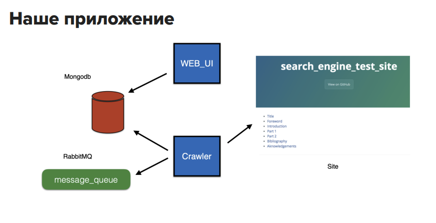
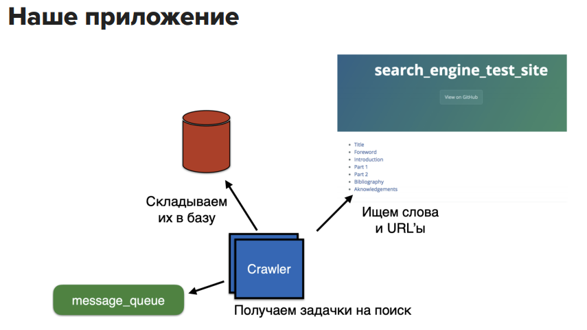
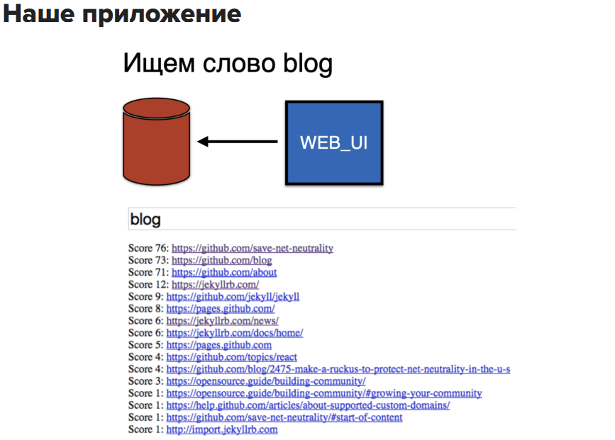

# coursework
## Создание процесса непрерывной поставки для приложения с применением Практик CI/CD.
# 1. Прилажение "Search Engine Crawler".
# 2. Web - intarface "Search Engine UI".
# 3. Monitoring tool - "Grafana".
# 4. Список необходимого ПО для реализации проекта.
# 5. ссылки на доп матерриалы.

## 1.1 - Описание -
Поисковый бот для сбора текстовой информации с веб-страниц и ссылок.
Бот помещает в очередь url переданный ему при запуске. 
Затем он начинает обрабатывать все url в очереди. 
Для каждого url бот загружает содержимое страницы, записывая в БД связи между сайтами, между сайтами и словами. 
Все найденые на странице url помещает обратно в очередь.

# 2.1 - Описание -
Веб-интерфейс поиска слов и фраз на проиндексированных ботом сайтах.
Веб-интерфейс минимален, предоставляет пользователю строку для запроса и результаты. 

Поиск происходит только по индексированным сайтам. Результат содержит только те страницы, на которых были найдены все слова из запроса. Рядом с каждой записью результата отображается оценка полезности ссылки (чем больше, тем лучше).
